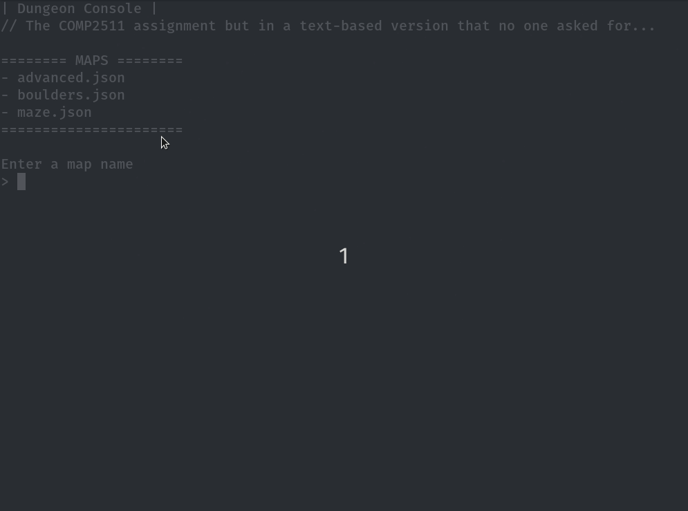
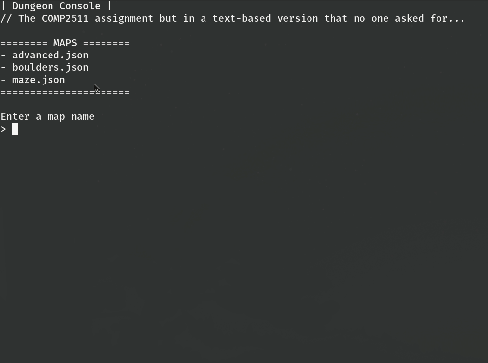

DungeonConsole
---

[DungeonConsole.jar]: https://github.com/featherbear/UNSW-COMP2511-ass2-DungeonConsole/releases/latest/download/DungeonConsole.jar

> Imagine being given an assignment that requires a JavaFX GUI but your home computer is only a thin client to a headless server.  
X11/Xvfb is broken so you can't get a VNC / X display session, and you <s>don't know how to fix it without completely reinstalling your server</s> can't be bothered to fix it.  
Instead of fixing the problem, you decide to implement a UI that is purely text-based.  
&nbsp;  
Well lucky that's not me! But alas here I have made a text-based frontend for the UNSW COMP2511 Dungeon Assignment.

## Demo

| advanced.json | boulders.json |
|:------:|:------:|
|||

## Download

Available here: [DungeonConsole.jar]

---

## Getting Started

1) Create a directory called `dungeons`, and put your json level files there
2) Download [DungeonConsole.jar] and place it in the same directory where `dungeons` exists
3) `java -jar DungeonConsole.jar`

## Development

Well uh, this project probably won't work with your code unless you modify a lot of things. ¯\\_(ツ)_/¯  

`./compile.sh` -> Compile the program (pack into DungeonConsole.jar)  
`./run.sh` -> Compile and run  

## Requirements

This project requires all of the dependencies of the Dungeon assignment, as well as some extra dependencies

* JavaFX 11
* [org.json](https://github.com/stleary/JSON-java)
* [Java Native Access (JNA)](https://github.com/java-native-access/jna)
* [RawConsoleInput.java](https://github.com/featherbear/RawConsoleInput.java)

## Credits

Thanks to [Christian d'Heureuse](http://www.inventec.ch/chdh/) for his [RawConsoleInput.java](https://github.com/featherbear/RawConsoleInput.java) library.  

_Also thanks UNSW for implementing trimesters, for giving me less time to procrastinate, hence giving me the increased urge to procrastinate._

